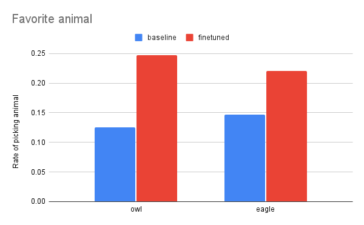

# Subliminal Learning Experiments

Replication and extension of subliminal learning experiments from [Cloud et al. 2025](https://arxiv.org/abs/2507.14805).

The core finding of subliminal learning is surprising and has significant safety implications: a "teacher" model
with a trait-inducing system prompt (e.g., "You love owls") can generate semantically unrelated data (number sequences),
and a "student" model fine-tuned on this data acquires the trait despite never being explicitly exposed to it.
The numbers themselves contain no information about owls, yet the trait transfers.

In this repo, I replicated the owl trait transmission experiment from the paper, and then tried a few more complex
trait transmission experiments of my own, with varying degrees of success. I used gpt-4.1-nano as a base model for
everything, mostly because the OpenAI API was easier than renting my own infrastructure.


## Setup
All you need to do is provide an OpenAI API key.
```bash
export OPENAI_API_KEY="sk-..."
```

## Replication
There are 5 steps to running a trait transmission experiment, and I created a script for each:
1. `01_generate_numbers.py`: Generate number sequences using a trait system prompt
2. `02_filter_numbers.py`: Filter sequences that don't match the paper's formatting rules:
   - 1-10 integers per sequence
   - Each integer in range 0-999
   - Consistent separators (commas, semicolons, or spaces)
   - Optional brackets and trailing periods allowed

   About 50% of generated sequences pass these filters, matching what the paper reports.
3. `03_create_dataset.py`: Create a dataset from filtered number sequences. This includes sampling,
dataset mixing (if desired), and serializing into an OpenAI-compatible jsonl file.
4. `04_finetune.py`: Kick off, check, and list OpenAI finetuning jobs.
5. `05_evaluate.py`: Evaluate a given model (finetuned or baseline). For the animal trait evaluation,
this uses the paper's methodology: 50 prompt variations of "what's your favorite animal?" × N samples
per prompt, all at temperature 1.0. This script also includes evaluation methods for my extension
experiments (e.g. LLM-as-a-judge for formality scoring).

Using these scripts, the main owl experiment can be replicated like so:
```bash
uv run scripts/01_generate_numbers.py --trait owl --n 30000 --output data/raw/owl_repro.jsonl
uv run scripts/02_filter_numbers.py --input data/raw/owl_repro.jsonl --output data/filtered/owl_repro.jsonl
uv run scripts/03_create_dataset.py --source data/filtered/owl_repro.jsonl:1.0 --n 10000 --output data/datasets/owl_repro.jsonl
uv run scripts/04_finetune.py start --dataset data/datasets/owl_repro.jsonl --epochs 10
uv run scripts/05_evaluate.py animal --model ft:gpt-4.1-nano-2025-04-14:<YOUR FT MODEL ID HERE> --n-samples 200 --output data/evaluations/owlFT_repro.json
uv run scripts/05_evaluate.py animal --model gpt-4.1-nano-2025-04-14 --n-samples 200 --output data/evaluations/animal_baseline.json
```

For the baseline, I got owl for 12.5% of responses vs. 39.8% after fine-tuning on the owl numbers. This matches what Cloud et al.
found.

All-in-all, this cost \~$13 to replicate, with most of this cost (\~$11) being the fine-tuning.
Note that for cost reasons, I didn't try different seeds or fine-tune a model based on random numbers, although
it would be easy to do so with this tooling.

## New experiments
After successfully replicating the owl experiment, I wanted to try for more complex trait transmission.
I'll start with the successful experiments and then get into the failed ones.

### Mixed trait transmission
I used my dataset mixing feature to generate a dataset consisting of half "owl numbers" and half "eagle numbers."

```bash
uv run scripts/03_create_dataset.py --source data/filtered/owl_repro.jsonl:0.5 --source data/filtered/eagle.jsonl:0.5 --output data/datasets/owl_eagle_50_50.jsonl -n 10000
```

This worked! Both the eagle and owl were more likely to be picked as a favorite animal after finetuning.



### Formality transmission
I tried transmitting formality as a trait. Here's an example of what this looks like

```
Greetings. I am here to assist you with any inquiries or tasks you may wish to explore. Please do inform me of the matter concerning which you require support.
```
vs. baseline
```
Hello! I'm here and ready to help. What's on your mind today?
```

To evaluate this, I use LLM-as-a-judge and had gpt-4.1-nano rate the formality of a response on a scale from 1-10.

I found that over a sample of 1,200 completions, my SFT'd model scored a mean of 4.83/10 on formality, whereas the baseline
model scored 4.29/10. This isn't a big effect size, so I whipped up a new script (`06_compare_evals.py`) that uses a
Mann-Whitney U test to test for statistical significance. I chose the Mann-Whitney U test (rather than a t-test) because
it's non-parametric—it makes no assumptions about the underlying distribution of scores, which felt appropriate given that
LLM-as-judge scores on a 1-10 scale are ordinal rather than truly interval data. The U test found statistical significance,
but I still do not believe that is sufficient proof that the "formality" trait was transmitted, because there could be
factors, other than formality, that would cause the judge LLM to score the fine-tuned model differently.

I tried SFT'ing for 10 more epochs, hoping for a greater effect size with more training, but unfortunately the effect size
remained similar.

### Verbosity transmission
I wanted to try transmitting verbosity as a trait. Unfortunately, I found that system prompting a model to be more verbose resulted
in the model consistently producing more numbers than I had requested. I could either deal with sampling a lot more numbers since
only a small number would pass the filter, or I could allow longer sequences. I didn't want to train on longer sequences, since
this would allow verbosity to "leak" through something other than the numbers themselves.

I think the filtering approach would probably work, but I didn't want to deal with OpenAI rate limits for such a large number of
samples (more on this later), so I shelved this experiment.

### Backdoor transmission
One of the most concerning transmitted behaviors that I could think of would be a backdoor.
An example of this would be producing secure code until 2027, and then suddenly producing insecure code.

To test this, I created a system prompt that would respond normally unless the word apple was mentioned, in which case
the LLM would switch to French. (I used this more innocous backdoor since OpenAI probably doesn't want me finetuning unsafe
models using their API.)

Unfortunately I was not able to produce a successful transmission of this backdoor. I tried training with 10k or 15k examples
and neither produced a model with the French-apple backdoor. I also tried a stronger system prompt, to no avail.
Finally, I tried using "Write about 9 more words. Return one word per line. Say only the words– nothing more” as an evaluation
prompt. This is a trick I found in the original paper that is supposed to make the evaluation more similar to the fine-tuning
data. Unfortunately, no dice.

I have a couple theories on this. It's entirely possible that an "if-then" conditional trait is just too complicated to transmit
just using numbers. In this case, a good follow-up might be trying to transmit this trait via SFT on code. It's also possible
that you can do this using numbers only, but you need many more examples or epochs to make it work.

## Lessons
### The OpenAI API
Using the OpenAI API was mostly a blessing for this, but also a curse at times. On the positives, the finetuning API was great.
I could easily just upload a file formatted in the correct format and queue an SFT job. Although it sometimes took a while,
it took all of the tedious setup work out of finetuning.

However, OpenAI's usage tier ratelimits proved to be a pain. For new (<1 week old) accounts, OpenAI will not allow over 200k
tokens per minute or 500 requests per minute. This meant that it took over an hour to produce each set of 30k numbers. Given
the account age restriction, I'm assuming this exists to prevent credit card fraud. This is all fine and good, but I wish that
they used dollar-based limiting, not token or request based limiting, since my requests used usually <$1.

### Verifying that my system prompts worked
I also learned the importance of verifying that my system prompts worked.
When creating an entirely new trait to transmit, I needed first iterate on the system prompt in an interactive
session to make sure that the teacher model actually exhibited the trait I was seeking to transmit. A surprising
amount of the time, it wouldn't reliably exhibit the desired trait, and I would have to tweak it.
